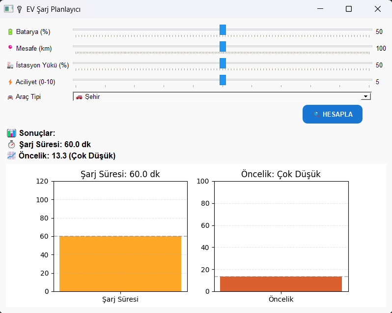

# README.md

# Akıllı EV Şarj Planlama Sistemi (Bulanık Mantık)

Bu proje, elektrikli araçların (EV) akıllı şarj sürelerini ve şarj önceliklerini belirlemek için **bulanık mantık tabanlı bir kontrolcü** kullanır. Proje, **PyQt5** ile oluşturulmuş kullanıcı dostu bir arayüz ve **matplotlib** ile çizilen çıktı grafiklerini içerir.

---

## 🚗 Problem Tanımı
Elektrikli araçların şarj istasyonlarındaki yükünü azaltmak ve kullanıcıya uygun, hızlı ve dengeli bir şarj sistemi sağlamak amacıyla; batarya durumu, tahmini mesafe, istasyon yoğunluğu, aciliyet ve araç tipi gibi değişkenleri kullanarak **şarj süresi** ve **öncelik puanı** hesaplanmaktadır.

---

## 📌 Kullanılan Girdiler
1. **Batarya Durumu (%):** 0-100
2. **Mesafe (km):** 0-200
3. **İstasyon Yükü (%):** 0-100
4. **Aciliyet (0-10):** 0-10
5. **Araç Tipi:** Şehir, Uzun Yol, Premium

## 🎯 Üretilen Çıktılar
- **Şarj Süresi (dakika)**
- **Öncelik Puanı (0-100)**

---

## 📦 Gereksinimler
Aşağıdaki komut ile gerekli Python paketlerini yükleyebilirsiniz:
```bash
pip install -r requirements.txt
```
veya tek tek yüklemek isterseniz:
```bash
pip install pyqt5 matplotlib scikit-fuzzy numpy
```
---

## 🖥️ Projeyi Çalıştırma
Adımlar:
```bash
git clone https://github.com/yusuf-yesil/ElektrikliAraclaricinBulanikMantikTabanliSarjOnceliklendirme.git
cd ElektrikliAraclaricinBulanikMantikTabanliSarjOnceliklendirme
pip install -r requirements.txt
python main.py
```

---

## 📁 Dosya Yapısı

```
ElektrikliAraclaricinBulanikMantikTabanliSarjOnceliklendirme/
│
├── main.py              # PyQt5 arayüz ve grafik gösterimi
├── ev_fuzzy.py          # Bulanık mantık sistemi ve kurallar
├── requirements.txt     # Paket bağımlılıkları
├── README.md            # Proje açıklamaları
└── screenshots/
    └── gui_example.png  # Arayüz ekran görüntüsü
```

---

## 🧠 Nasıl Çalışır?
- Kullanıcı, batarya, mesafe, istasyon yükü gibi verileri GUI üzerinden girer.
- Bu veriler, `ev_fuzzy.py` dosyasındaki bulanık sistem modeline aktarılır.
- Sistem, kurallar ve üyelik fonksiyonları yardımıyla **şarj süresi** ve **öncelik puanı** hesaplar.
- Sonuçlar, arayüzde gösterilir ve **matplotlib** ile grafikleştirilir.

---

## 📷 Arayüz Ekranı


---
